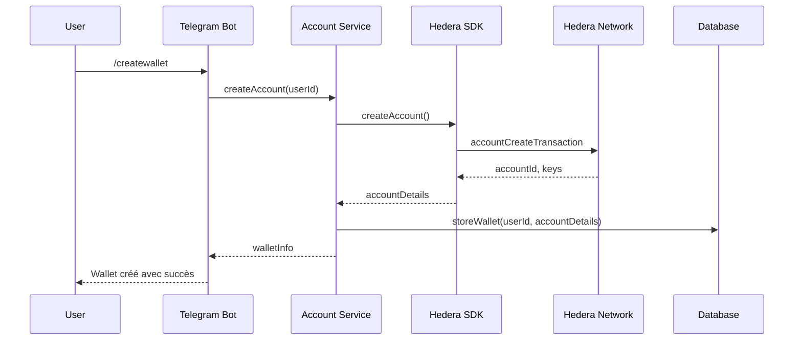
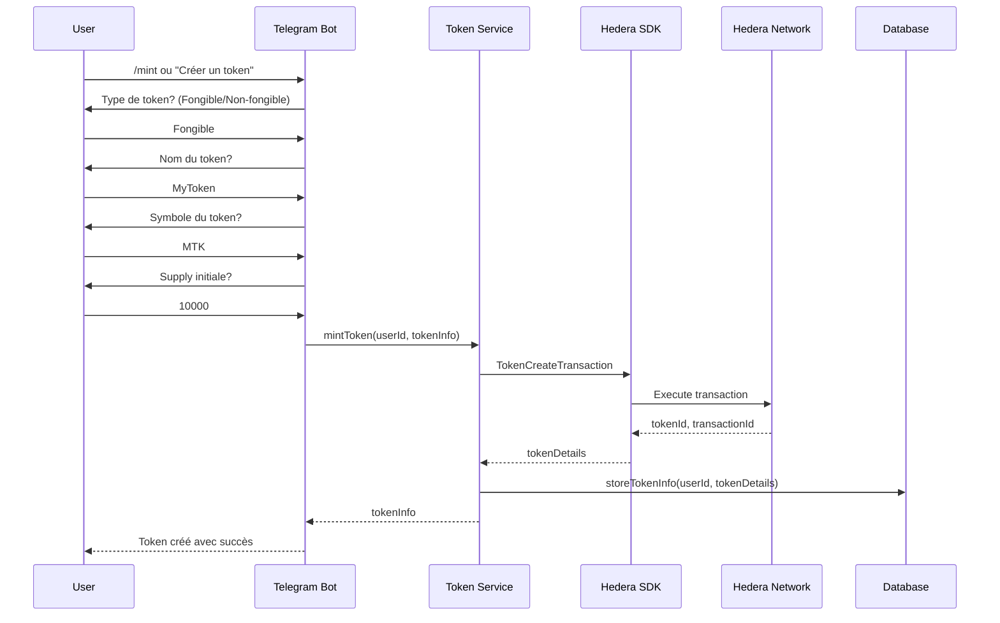

# Architecture du Projet

Ce document décrit l'architecture technique du wallet custodial Hedera avec intégration de bot Telegram.

## Vue d'ensemble

L'application est construite autour d'une architecture modulaire, avec plusieurs composants principaux qui interagissent pour offrir toutes les fonctionnalités du wallet :

## Composants principaux

### 1. Interface Bot Telegram

Ce composant gère les interactions entre les utilisateurs et le wallet via l'API Telegram Bot. Il est responsable de :

- Recevoir et analyser les commandes utilisateur
- Traiter les messages en langage naturel
- Gérer les conversations interactives
- Présenter les résultats des opérations blockchain

**Fichiers clés** :
- `src/telegram/bot.js` - Configuration et initialisation du bot
- `src/telegram/commands.js` - Gestionnaires de commandes et conversations

### 2. Traitement du langage naturel

Ce composant utilise l'API OpenAI pour comprendre les intentions des utilisateurs exprimées en langage naturel. Il convertit des phrases comme "Envoie 5 HBAR à l'adresse 0.0.12345" en commandes structurées.

**Fichiers clés** :
- `src/services/openai-service.js` - Intégration avec l'API OpenAI
- `src/agent/nlp-processor.js` - Traitement des intentions détectées

### 3. Intégration Hedera Agent Kit

Ce composant fait le pont entre notre application et l'Hedera Agent Kit officiel, permettant des opérations avancées sur la blockchain Hedera.

**Fichiers clés** :
- `src/agent/hedera-agent-kit-adapter.js` - Adaptateur pour l'Hedera Agent Kit
- `src/agent/hedera-agent-kit-integration.js` - Intégration des fonctionnalités du kit
- `src/agent/official-kit-adapter.js` - Adaptateur pour la version officielle du kit
- `src/agent/kit-manager.js` - Gestionnaire central pour l'accès au kit

### 4. Opérations Hedera

Ce composant contient les fonctions de base pour interagir avec le réseau Hedera, en utilisant directement le SDK Hedera.

**Fichiers clés** :
- `src/hedera/account.js` - Gestion des comptes Hedera
- `src/hedera/tokens.js` - Opérations liées aux tokens
- `src/hedera/transactions.js` - Transactions et historique
- `src/hedera/topic-management.js` - Gestion des topics HCS

### 5. Stockage et persistance

Ce composant gère le stockage des informations utilisateur, des wallets et des tokens dans la base de données PostgreSQL.

**Fichiers clés** :
- `src/storage/db.js` - Configuration de la connexion à la base de données
- `src/storage/userWallets.js` - Gestion des wallets utilisateur

### 6. API REST

Une API REST exposant les fonctionnalités du wallet pour une intégration avec d'autres applications.

**Fichiers clés** :
- `src/api.js` - Définition des routes API
- `src/index.js` - Point d'entrée et configuration du serveur

## Flux de données

1. **Entrée utilisateur** : L'utilisateur envoie une commande ou un message en langage naturel au bot Telegram.
2. **Analyse de l'intention** : Si c'est un message en langage naturel, il est analysé par le service OpenAI pour déterminer l'intention.
3. **Exécution** : L'action correspondante est exécutée, ce qui peut impliquer des interactions avec le réseau Hedera, la base de données, ou l'Hedera Agent Kit.
4. **Réponse** : Les résultats sont formatés et renvoyés à l'utilisateur via le bot Telegram.

## Diagrammes de séquence

### Création de wallet

### Création de token interactive

## Points d'extension

Le projet a été conçu pour être facilement extensible. Voici quelques points d'extension possibles :

1. **Support multi-langue** : Ajouter des traductions pour les interactions du bot.
2. **Support de tokens non-fongibles** : Étendre la fonctionnalité actuelle pour créer et gérer des NFT.
3. **Interface utilisateur Web** : Développer une interface web qui interagit avec l'API REST.
4. **Sécurité renforcée** : Ajouter des couches de sécurité supplémentaires comme l'authentification à deux facteurs.
5. **Intégration de services DeFi** : Ajouter des fonctionnalités comme le staking ou la participation à des pools de liquidité.