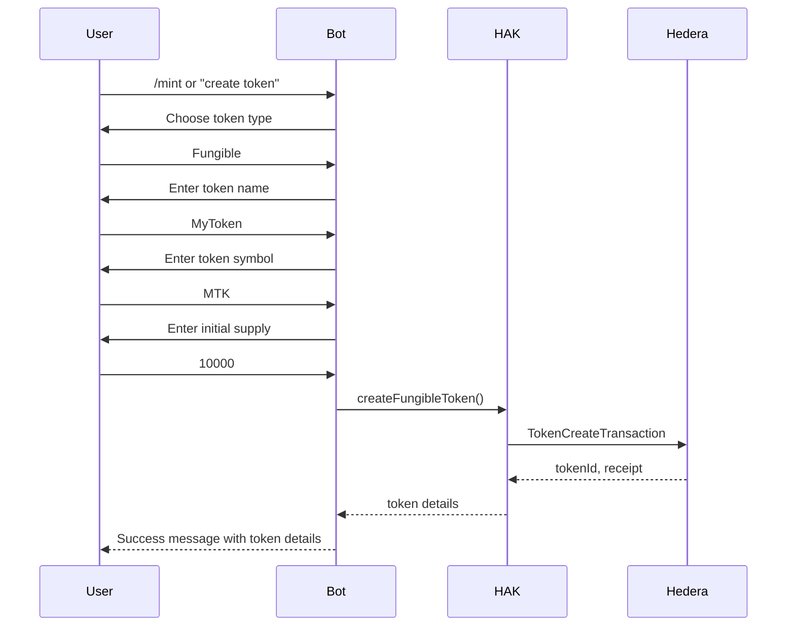

# Intégration avec Hedera Agent Kit

Ce document détaille l'intégration du wallet custodial Hedera avec l'Hedera Agent Kit (HAK), une bibliothèque officielle fournie par Hedera pour simplifier les interactions avec le réseau Hedera Hashgraph.

## Qu'est-ce que l'Hedera Agent Kit ?

L'Hedera Agent Kit est une suite d'outils qui facilite l'interaction avec la blockchain Hedera, en offrant un ensemble d'API de haut niveau pour les développeurs qui souhaitent créer des applications sur Hedera. Le kit prend en charge diverses fonctionnalités comme :

- Création et gestion de comptes
- Transfert d'HBAR et de tokens
- Gestion des tokens (fongibles et non-fongibles)
- Interactions avec le Hedera Consensus Service (HCS)
- Intégration avec les modèles d'IA via LangChain

## Architecture d'intégration

Notre application utilise l'Hedera Agent Kit à travers différentes couches d'adaptation :

1. **Kit Manager** - Gère l'initialisation du kit et fournit un accès centralisé
2. **Adapter** - Adapte l'interface du kit à notre structure d'application
3. **Integration** - Intègre les fonctionnalités du kit dans nos services
4. **Official Kit Adapter** - Support pour la version officielle du kit


## Méthodes d'initialisation

Le kit est initialisé avec les identifiants Hedera et configuré pour le réseau approprié (testnet/mainnet) :

```javascript
async function initializeAgentKit() {
  try {
    // Récupérer les identifiants depuis les variables d'environnement
    const accountId = config.HEDERA_AI_KIT_ACCOUNT_ID;
    const privateKey = config.HEDERA_AI_KIT_PRIVATE_KEY;
    
    if (!accountId || !privateKey) {
      console.error("Missing Hedera Agent Kit credentials");
      return null;
    }
    
    // Initialiser le client Hedera
    const client = Client.forTestnet();
    
    // Initialiser le kit
    const kit = new KitManager({
      hederaClient: client,
      operatorId: accountId,
      operatorKey: privateKey,
      network: 'testnet'
    });
    
    console.log("✅ Hedera Agent Kit initialized successfully");
    return kit;
  } catch (error) {
    console.error(`Error initializing Hedera Agent Kit: ${error.message}`);
    return null;
  }
}
```

## Fonctionnalités intégrées

### 1. Gestion des comptes

Le kit permet la gestion simplifiée des comptes Hedera :

```javascript
async function getHbarBalance(accountId) {
  const kit = await initializeOfficialKit();
  const balance = await kit.getAccountBalance(accountId);
  return {
    success: true,
    balance: balance.hbars.toString(),
    accountId: accountId
  };
}
```

### 2. Tokens fongibles

La création et le transfert de tokens fongibles sont facilités :

```javascript
async function createFungibleToken(userId, tokenInfo) {
  const kit = await getHederaAgentKit();
  
  const options = {
    name: tokenInfo.name,
    symbol: tokenInfo.symbol,
    decimals: tokenInfo.decimals || 0,
    initialSupply: tokenInfo.initialSupply || 1000,
    maxSupply: Math.min(tokenInfo.maxSupply || 0, 100000000),
    memo: `Token créé par l'utilisateur ${userId}`
  };
  
  const result = await kit.createFT(options);
  
  return {
    success: result.success,
    tokenId: result.tokenId,
    message: result.success ? 
      `Token créé avec succès ! Nom: ${tokenInfo.name}, Symbole: ${tokenInfo.symbol}` : 
      (result.error || 'Erreur lors de la création du token')
  };
}
```

### 3. Hedera Consensus Service

Le kit permet de gérer facilement les topics HCS :

```javascript
async function createTopic(userId, topicMemo, isSubmitKey = false) {
  const kit = await initializeOfficialKit();
  const result = await kit.createTopic(topicMemo, isSubmitKey);
  
  return {
    success: true,
    message: `Topic créé avec succès: ${topicMemo}`,
    topicId: result.topicId.toString(),
    topicMemo,
    isSubmitKey,
    transactionId: result.txHash,
    explorerUrl: getExplorerUrls(result.topicId.toString(), 'topic').hashScan
  };
}
```

## Processus de création de token interactive

L'un des aspects clés de notre application est le processus interactif de création de token, qui utilise l'Hedera Agent Kit pour créer des tokens fongibles.

Ce processus se déroule en plusieurs étapes :

1. L'utilisateur lance le processus via la commande `/mint` ou une phrase en langage naturel
2. L'utilisateur choisit le type de token (fongible/non-fongible)
3. L'utilisateur fournit un nom pour le token
4. L'utilisateur fournit un symbole pour le token (ou accepte la suggestion automatique)
5. L'utilisateur spécifie l'offre initiale (limitée à 100 000 000 unités maximum)
6. Le système crée le token via l'Hedera Agent Kit
7. Les détails du token sont renvoyés à l'utilisateur



## Défis d'intégration

Plusieurs défis ont été rencontrés lors de l'intégration :

1. **Compatibilité des modules** - L'Hedera Agent Kit utilise le format ESM tandis que notre application utilise CommonJS, ce qui a nécessité la création d'adaptateurs.

2. **Gestion des erreurs** - Le kit et notre application ont des structures de gestion d'erreurs différentes, ce qui a nécessité une homogénéisation.

3. **Persistance des données** - Le kit ne gère pas la persistance, nous avons donc dû synchroniser les opérations du kit avec notre base de données.

4. **Custodial vs Non-custodial** - L'adaptation du mode custodial (où les clés sont stockées par le service) au mode non-custodial du kit.

## Avantages de l'utilisation du Hedera Agent Kit

L'intégration du Hedera Agent Kit offre plusieurs avantages :

1. **Simplicité** - Réduction de la complexité du code pour les interactions avec Hedera
2. **Maintenance** - Moins de code à maintenir, car de nombreuses fonctionnalités sont gérées par le kit
3. **Évolutivité** - Facilité d'ajout de nouvelles fonctionnalités à mesure que le kit évolue
4. **Standardisation** - Approche standard pour interagir avec Hedera
5. **Intégration IA** - Possibilité d'utiliser les capacités d'IA du kit pour étendre les fonctionnalités

## Perspectives d'évolution

L'intégration du Hedera Agent Kit ouvre plusieurs possibilités d'évolution :

1. **Support complet des NFT** - Intégrer la création et la gestion de tokens non-fongibles
2. **Intégration avec LangChain** - Utiliser les capacités d'IA avancées du kit pour des interactions plus naturelles
3. **Smart Contracts** - Faciliter l'interaction avec les smart contracts sur Hedera
4. **Mode non-custodial** - Ajouter un support pour un mode où les utilisateurs gèrent leurs propres clés
5. **Multi-signature** - Implémenter des opérations à signatures multiples pour une sécurité accrue

## Ressources

- [Documentation officielle de l'Hedera Agent Kit](https://docs.hedera.com/agent-kit)
- [GitHub du Hedera Agent Kit](https://github.com/hashgraph/hedera-agent-kit)
- [Documentation de l'API Hedera](https://docs.hedera.com/api)